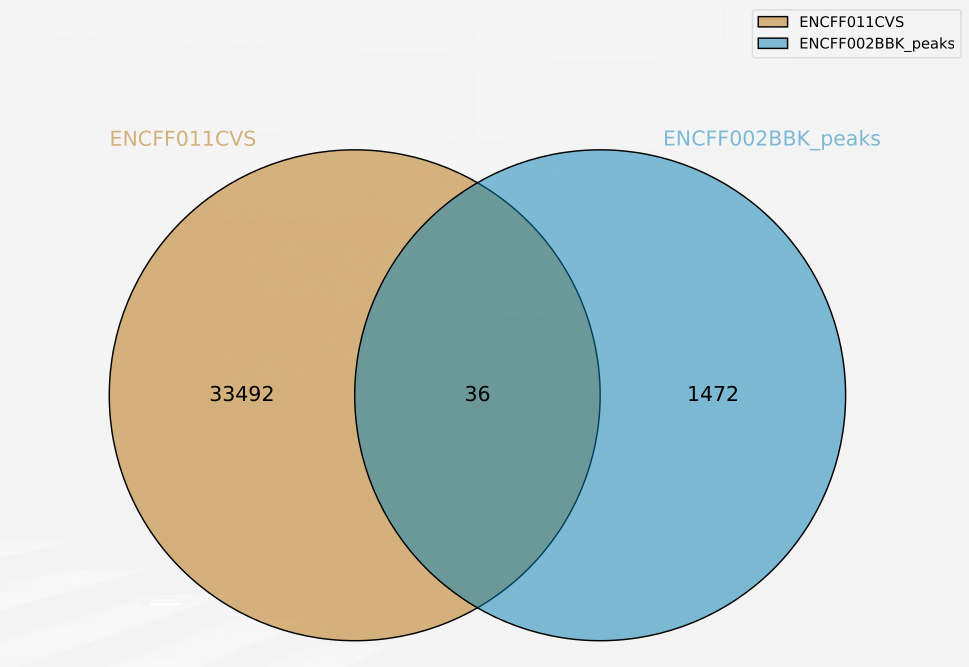

# hse24_hw2

## Егор Портнягин 3 группа

### [блокнот](sol.ipynb)

|       | реплика 1                         | реплика 2                         | контроль                          |
|-------|-----------------------------------|-----------------------------------|-----------------------------------|
| id    | ENCFF002BBK                       | ENCFF637NPE                       | ENCFF002BBQ                       |
| отчёт | [отчёт1](ENCFF002BBK_fastqc.html) | [отчёт2](ENCFF637NPE_fastqc.html) | [отчёт3](ENCFF002BBQ_fastqc.html) |

| реплика 1        | реплика 2        | контроль         |
|------------------|------------------|------------------|
|  |  |  |
|  |  |  |
|  |  |  |
|  |  |  |
|  |  |  |
|  |  |  |

|                | реплика 1         | реплика 2         | контроль          |
|----------------|-------------------|-------------------|-------------------|
| всего ридов    | 22139664          | 46664563          | 21124914          |
| уникально      | 924337 (4.18%)    | 1743956 (3.74%)   | 845994 (4.00%)    |
| не уникально   | 3137457 (14.17%)  | 5377585 (11.52%)  | 3096926 (14.66%)  |
| не выравнялось | 18077870 (81.65%) | 39543022 (84.74%) | 17181994 (81.34%) |

| x         | x с ENCODE        | ENCODE с x        |
|-----------|-------------------|-------------------|
| реплика 1 |  |  |
| реплика 2 |  |  |

Так как выравнивали только на одну хромосому пересечений получилось довольно мало, в ENCODE пики были составлены для всех хромосом, поэтому при пересечении наших данных с ENCODE и ENCODE с нашими данными результаты разные